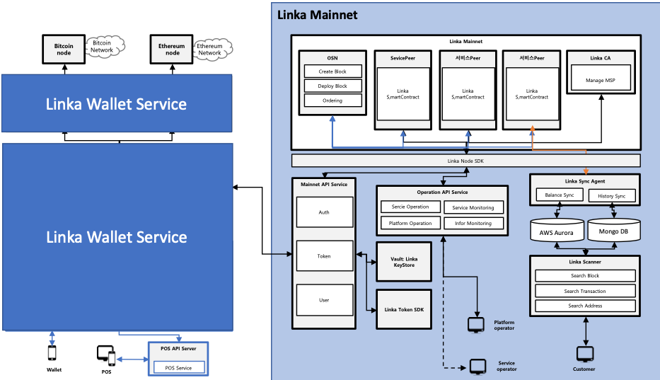
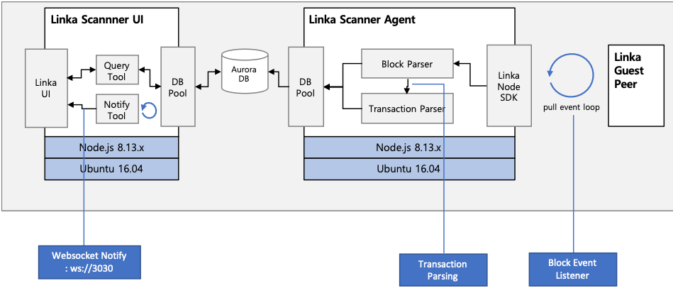

# Linka Scaner Agent

### Linka Mainnet Architecture

### Linka Scanner Architecture

## Install
sudo npm install pm2 -g
npm install 

## Run
bash start.sh

## License
It's not decided yet, but we'll update it later.